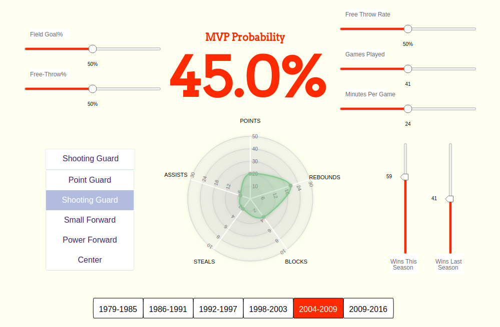

# NBA MVP Probability Predictor

## Introduction

The main objective of this visualization was to create a fun yet informative too to understand the statistics behind what makes the NBA’s best player. 

As a basketball fan myself, I thoroughly enjoyed both building and utilizing it. My goal is for fellow basketballs to peruse this tool for their pleasure.

The predictor can be used to explore the most important statistical factors in determining the NBA’s MVP; or, it can be used to assessed any player’s current or previous probability of being MVP given the statistics.

## Running the Demo
First, prepare the environment:
```sh
$ npm install

```

In a new shell, start the server:
```sh
$ npm run start-server

```

Next, start the client:
```sh
$ npm run start-client

```

Open the client running at: http://localhost:8080/




The user can then interact with the visualization by:

    * the sliders can be dragged and dropped to adjust the value
  
    * the timeline buttons can be clicked on to choose a time period
    
    * “Select a Position” can be clicked on, which exposes a dropdown list of the different basketball positions
    
    * the radar chart can be drag and dropped along the to select any of the axis values.


